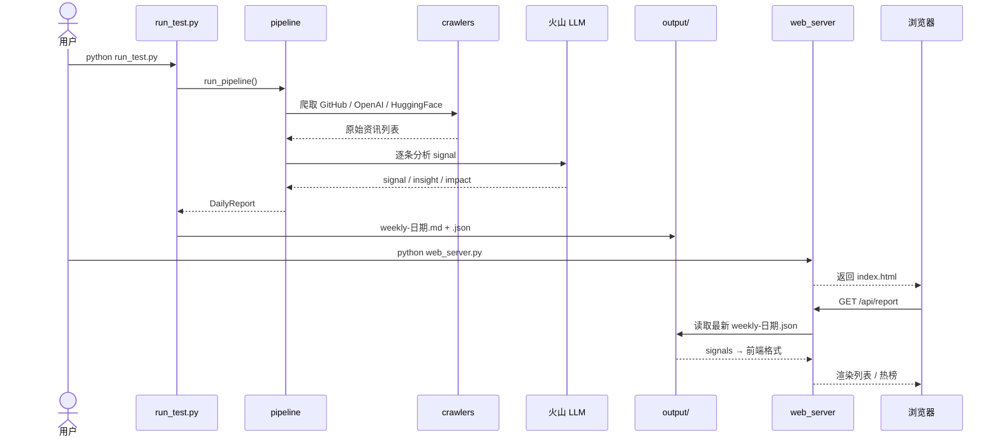

# ai-weekly

AI 资讯采集 → LLM 分析 → 周报生成 → Web 展示。

## 安装

```powershell
git clone https://github.com/deerXXL/my-ai-weekly.git
cd my-ai-weekly
python -m venv .venv
.venv\Scripts\Activate.ps1          # macOS/Linux: source .venv/bin/activate
pip install flask python-dotenv openai requests beautifulsoup4 feedparser
```

> `requirements.txt` 为 Conda 全量导出，勿直接 `pip install -r`。

## 配置

根目录创建 `.env`：

```env
ARK_API_KEY=你的火山方舟Coding_Plan_API_Key
ARK_BASE_URL=https://ark.cn-beijing.volces.com/api/coding/v3
ARK_MODEL=ark-code-latest
```

API Key 在 [火山方舟控制台](https://console.volcengine.com/ark) 获取。

## 使用

```powershell
# 生成日报 → output/weekly-日期.md / .json
python run_test.py

# 启动前端 → http://127.0.0.1:5000
python web_server.py

# 定时任务（每天 9:00，可选）
python scheduler.py
```

Windows 若 emoji 乱码：`$env:PYTHONIOENCODING='utf-8'`

## 项目结构

```
app/crawlers/    爬虫        run_test.py      生成日报
app/services/    LLM/输出    web_server.py    Web 展示
app/pipeline.py  主流程      scheduler.py     定时任务
templates/ + static/         前端页面
output/                      输出文件
```

## 使用时序


