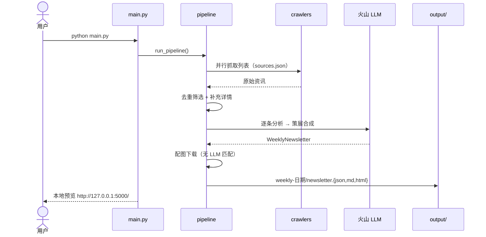

# 闪联AI周刊

AI 资讯采集 → LLM 分析策展 → 周刊生成 → 本地 HTML 预览 / 网页浏览 / 邮件推送。

---

## 1. 快速开始

```bash
git clone https://github.com/deerXXL/my-ai-weekly.git
cd my-ai-weekly

# 创建虚拟环境并安装依赖
python -m venv .venv
.venv\Scripts\Activate.ps1          # macOS/Linux: source .venv/bin/activate
pip install -r requirements.txt

# 在项目根目录创建 .env 并填入配置（见第 2 节）
# 生成双周周刊并启动本地预览
python main.py
# 浏览器打开 http://127.0.0.1:5000/
```

> Windows 若 emoji 乱码，运行前先执行：`$env:PYTHONIOENCODING='utf-8'`

---

## 2. 配置（项目根目录 `.env`）

> `.env` 已被 `.gitignore` 忽略，不会提交到仓库，请本地妥善保存。

### 2.1 生成周报所需（必填）

```env
ARK_API_KEY=你的火山方舟Coding_Plan_API_Key
ARK_BASE_URL=https://ark.cn-beijing.volces.com/api/coding/v3
ARK_MODEL=ark-code-latest
ARK_IMAGE_BASE_URL=https://ark.cn-beijing.volces.com/api/v3
ARK_IMAGE_MODEL=doubao-seedream-4-5-251128
```

⚠️ **`ARK_BASE_URL` 必须是 `/api/coding/v3`（带 `coding`）**，不是标准的 `/api/v3`。
用 ARK Key 请求标准端点会报 `401 AuthenticationError: The API key format is incorrect`。

ARK_API_KEY 在 [火山方舟控制台](https://console.volcengine.com/ark) 获取。

### 2.2 邮件推送所需（可选，发邮件才用）

```env
# 收件人：多个邮箱用英文逗号分隔
QQ_MAIL_RECEIVERS=lijq@igrslab.com,other1@qq.com,other2@163.com
# 发件 QQ 邮箱的授权码（注意是“授权码”，不是 QQ 登录密码）
QQ_MAIL_PASSWORD=你的QQ邮箱授权码
# 周报网页地址（收信人可点开在线查看完整页面）
WEEKLY_SITE_URL=https://ai-weekly-report.onrender.com/
```

- 发件人固定为代码中的 `3540737632@qq.com`，如需更换请改 `send_md_email.py` 顶部 `SENDER`。
- QQ 邮箱授权码在：QQ 邮箱 → 设置 → 账户 → 生成授权码。

### 2.3 代理（可选）

默认直连，不使用系统 / Clash 注入的 `HTTP_PROXY` / `HTTPS_PROXY`。
抓取海外源需要代理时：

```env
AI_WEEKLY_USE_PROXY=1
HTTP_PROXY=http://127.0.0.1:7897
HTTPS_PROXY=http://127.0.0.1:7897
```

若 `AI_WEEKLY_USE_PROXY=1` 但本地代理未启动，海外源请求会失败（超时或 connection refused），国内源不受影响。

---

## 3. 使用方式

### 3.1 本地生成 + 预览（`main.py`）

```bash
python main.py                  # 生成双周周刊并启动本地预览（默认 http://127.0.0.1:5000/）
python main.py --serve-only    # 跳过生成，仅预览已有最新一期
python main.py --port 5001     # 自定义端口
python main.py --host 0.0.0.0 # 允许局域网内其他设备访问
```

### 3.2 仅生成（不预览）

```bash
python generate_weekly.py --days 14              # 生成最近 14 天，写入 output/weekly-YYYY-MM-DD/
python generate_weekly.py --days 14 --mode strict   # strict 模式：丢弃无日期的条目
```

### 3.3 网页服务

本地开发（Flask debug 模式）：

```bash
python web_app.py
```

生产 / 云端部署（Render 等，`Procfile` 默认命令）：

```bash
gunicorn web_server:app
```

网页功能：

- 首页浏览最新一期周刊（图文 HTML）
- 下拉框切换历史各期
- **「新增本期资讯」按钮**：在网页上直接跑完整流水线（抓取 → 分析 → 生成），无需命令行
- **导出**：下载自包含 ZIP（含 `newsletter.md` + `newsletter.html` + `images/`，解压即可离线看图文）
- 任务进度实时轮询（后台任务状态已持久化到 `output/tasks.json`，实例重启不丢失）

### 3.4 发送邮件（`send_md_email.py`）

```bash
python send_md_email.py              # 发送最新一期
python send_md_email.py 2026-07-14 # 发送指定日期那一期
```

邮件内容：

- HTML 正文（内嵌全部配图，兼容各邮箱客户端）
- `newsletter.md` 作为附件
- 正文末尾「在网页查看完整周报」链接（指向 `WEEKLY_SITE_URL`）

收件人由 `.env` 的 `QQ_MAIL_RECEIVERS` 决定，群发给列表中的所有邮箱（彼此可见）。

### 3.5 自动化：GitHub Actions 自动流

`.github/workflows/weekly.yml` 已配置：

- **触发**：每天 UTC 1:00（北京时间 9:00）自动运行；也可在 GitHub Actions 页面手动 `Run workflow`
- **动作**：`python generate_weekly.py --days 14` → 自动 `commit` 并 `push` 回仓库
- **密钥**：只需在 GitHub **Settings → Secrets → Actions** 配置 `ARK_API_KEY`；
  其余 4 个 ARK 变量已在 workflow 内硬编码（与本地 `.env` 完全一致）

### 3.6 自动化：本地定时调度（`scheduler.py`）

```bash
python scheduler.py    # 常驻进程，每天检查，距上次生成满 14 天则自动生成
```

### 3.7 部署到 Render

1. 在 Render 新建 **Web Service**，连接本 GitHub 仓库
2. Build Command：`pip install -r requirements.txt`
3. Start Command：`gunicorn web_server:app`（`Procfile` 已配，可留空）
4. 在 **Environment** 添加与 `.env` 相同的 5 个 `ARK_*` 变量（及可选邮件变量）
5. 部署完成后访问分配的 `https://xxx.onrender.com/`

> Render 免费版在无请求时会休眠，首次访问需冷启动十几秒。后台任务状态已持久化，重启不会丢失进度，但运行时的 `output/` 临时文件会在重新部署时被清空（已生成的内容需来自 Git 或重新生成）。

### 3.8 双周自动发送 + 自动清理（`weekly_send.sh`）

远端 Linux 部署用 `weekly_send.sh`（`/home/jinqi/my-ai-weekly/`），**完全独立于网页、单线运行**：

- **触发**：cron 每周一 09:00（`0 9 * * 1`）；建议从下周一（2026-07-20）启用。
- **发送**：脚本内判断距上次发送是否满 14 天，未满则跳过；满则 `generate_weekly.py --days 14` + `send_md_email.py` 双周发送。
- **自动清理**：每次触发**先**执行保留策略清理（直接调用 `app.services.retention`，不经过网页 `/api/collect`），保留最近 N 个不重复周期的期、删除更旧目录；发送仍受 14 天门槛控制。

```bash
# 远端 crontab -e
0 9 * * 1 /home/jinqi/my-ai-weekly/weekly_send.sh >> /home/jinqi/my-ai-weekly/scheduler.log 2>&1
```

> 远端需先 `git pull` 同步本仓库（含新增的 `app/services/retention.py` 与 `config.REPORT_RETAIN_ISSUES`），否则清理步骤会报缺模块。

---

## 4. 输出

### 4.1 目录结构

```
output/
  weekly-YYYY-MM-DD/        # 每期一个文件夹，文件夹名即期号日期
    newsletter.json          # 结构化数据
    newsletter.md            # Markdown 全文（可作邮件附件）
    newsletter.html          # 带图 HTML（邮件正文 / 网页预览源）
    images/                 # 本期配图
      cover.png
      img-0.gif ...
  latest.json               # 指向最新一期
  .latest                  # 最新一期目录名
  tasks.json               # 后台任务状态（持久化）
```

### 4.2 周刊栏目

每期周刊包含三个栏目：

- 🗓 本周概览
- 🚀 行业动态（智能配图，匹配才展示；部分条目含**使用说明**）
- 📈 本周 AI 技术总结（核心趋势 + 可行性思考）

### 4.3 周期与保留策略

**周期（每期覆盖的时间段）**：每期不再是「生成日前推 13 天」的滚动窗口，而是**以周一为锚点的双周块**——起点恒为周一、块长 14 天（周一至下下周日），相邻块首尾相接、无重叠。无论手动点击还是定时触发，落点都对齐到对应的双周块内，因此：

- 每期周期边界对齐周一；
- 相邻期严格相隔两周，不重叠、不遗漏；
- 锚点默认 `2026-07-20`（下周一，第 0 个双周块），可用环境变量 `AI_WEEKLY_PERIOD_ANCHOR=YYYY-MM-DD` 覆盖（须为周一）。

**保留策略**：仅保留最近 **N 个「不重复周期」**的期（默认 5，环境变量 `AI_WEEKLY_RETAIN_ISSUES` 覆盖），更旧的期在每次采集成功后自动删除。去重/排序以「周期」为单位（按 `period_start` 去重、`period_end` 排序），避免把同日生成但周期重叠的期刊误判为多期；`latest.json` / `.latest` / `tasks.json` 不会被清理。

---

## 5. 资讯来源与抓取策略

**国内（聚合源）**：AI工具集每日快讯、AIbase 资讯、XixAI 资讯
**海外**：GitHub Trending、OpenAI、Anthropic、HuggingFace、Google Research、TechCrunch、VentureBeat、Reddit、36氪、机器之心

所有抓取源在 `config/sources.json` 统一维护（启用/禁用、权重、国内/海外、是否补充详情）。

抓取策略：

1. 多站点并行拉取列表（国内源优先调度）
2. URL + 标题归一化去重，国内源保底，按权重排序
3. 对 Top 45 重点条目抓取文章页（描述、封面图）
4. LLM 逐条分析 → 策展合成 → 配图下载（配图不再调用 LLM 匹配）

---

## 6. 项目结构

```
app/
  crawlers/          爬虫采集（多数据源）
  models/            WeeklyNewsletter 数据模型
  services/          LLM / 过滤 / 配图 / 渲染 / 路径管理
  pipeline.py        主流程（run_pipeline）
config/
  newsletter.json    周刊品牌与栏目配置
  sources.json       抓取源配置
prompts/             LLM Prompt 模板
main.py              入口：生成 + 本地预览
generate_weekly.py   仅生成（供 CI / 定时调度调用）
web_app.py           网页服务入口（本地 debug）
web_server.py        Flask 应用（路由、导出、任务管理）
send_md_email.py     邮件推送
scheduler.py         本地双周定时调度
.github/workflows/   GitHub Actions 自动流
output/              周刊输出根目录
tests/               单元测试
```

---

## 7. 常见问题

**Q：报错 `401 AuthenticationError: The API key format is incorrect`**
A：多半是 `ARK_BASE_URL` 端点不对（必须用 `/api/coding/v3`，不是 `/api/v3`），或 `ARK_API_KEY` 过期 / 被重新生成 / 复制时带了空格换行。请与火山方舟控制台核对 Key，并在 Render / GitHub Secrets 中重新粘贴原值。

**Q：点「新增本期资讯」提示「任务已失效」**
A：旧版任务状态只存在内存，Render 实例休眠 / 重启后丢失。现已持久化到 `output/tasks.json`，重新部署后此问题消失。

**Q：导出的 md 看不到图片**
A：旧版导出只返回纯文本，图片不带走。现已改为导出**自包含 ZIP**（md + html + images 同级），解压即可看图文。

**Q：期号 / 日期顺序不对**
A：旧版期号未正确写入。现已由 `pipeline.py` 自动计算并写入 `issue_number`，新生成的一期会按时间顺序递增（最新一期编号最大）。

---

## 8. 安全提示

- `.env` 已被 `.gitignore` 忽略，不会进入仓库。
- ⚠️ **QQ 邮箱授权码曾明文写入 `send_md_email.py` 并推送到公开仓库历史**。现已改为从 `.env` 读取，但历史提交中仍有明文。建议：① 去 QQ 邮箱重新生成授权码；② 把 `.env` 里的 `QQ_MAIL_PASSWORD` 换成新的。
- 部署到 Render / 配置 GitHub Secrets 时，密钥请通过平台的环境变量 / Secret 配置，不要硬编码进代码。

---

## 9. 测试

```bash
pip install -r requirements-dev.txt
python -m pytest tests/ -q
```

---

## 10. 流程


