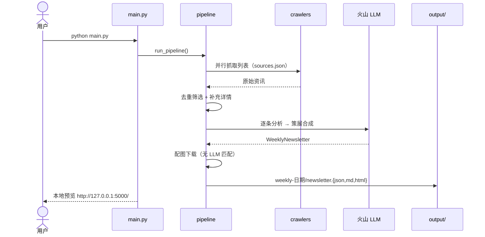

# 闪联AI周刊

AI 资讯采集 → LLM 分析策展 → 周刊生成 → 本地 HTML 预览。

## 安装

```powershell
git clone https://github.com/deerXXL/my-ai-weekly.git
cd my-ai-weekly
python -m venv .venv
.venv\Scripts\Activate.ps1          # macOS/Linux: source .venv/bin/activate
pip install -r requirements.txt
```

## 配置

根目录创建 `.env`：

```env
ARK_API_KEY=你的火山方舟Coding_Plan_API_Key
ARK_BASE_URL=https://ark.cn-beijing.volces.com/api/coding/v3
ARK_MODEL=ark-code-latest
```

API Key 在 [火山方舟控制台](https://console.volcengine.com/ark) 获取。

### 代理（可选）

**默认直连**，不会使用系统或 Clash 注入的 `HTTP_PROXY`/`HTTPS_PROXY`。

抓取海外源需要代理时，在 `.env` 显式开启：

```env
AI_WEEKLY_USE_PROXY=1
HTTP_PROXY=http://127.0.0.1:7897
HTTPS_PROXY=http://127.0.0.1:7897
```

若 `AI_WEEKLY_USE_PROXY=1` 但本地代理未启动，海外源请求会连接失败（超时或 connection refused），国内源不受影响。

## 使用

```powershell
# 生成周刊 + 启动本地 HTML 预览（默认 http://127.0.0.1:5000/）
python main.py

# 仅预览已有最新一期周刊
python main.py --serve-only

# 自定义端口
python main.py --port 5001
```

Windows 若 emoji 乱码：`$env:PYTHONIOENCODING='utf-8'`

导出最新一期（浏览器或 curl）：

```powershell
# Markdown
curl -OJ "http://127.0.0.1:5000/api/export?format=md"

# HTML
curl -OJ "http://127.0.0.1:5000/api/export?format=html"
```

## 资讯来源

**国内（聚合源）：**
- [AI工具集 每日快讯](https://ai-bot.cn/daily-ai-news/)
- [AIbase 资讯](https://www.aibase.com/zh/news)
- [XixAI 资讯](https://xix.ai/zh/ainews/ainews)

**海外：** GitHub Trending、OpenAI、Anthropic、HuggingFace、Google Research、TechCrunch、VentureBeat、Reddit、36氪、机器之心

所有抓取源在 `config/sources.json` 统一维护（启用/禁用、权重、国内/海外、是否补充详情）。

## 抓取策略

1. **抓取列表** — 多站点并行拉取标题/摘要（国内源优先调度）
2. **去重筛选** — URL + 标题归一化去重，国内源保底，按权重排序
3. **补充详情** — 对 Top 45 重点条目抓取文章页（描述、封面图）
4. **LLM 分析 → 策展 → 配图下载**（配图不再调用 LLM 匹配）

```
app/
  crawlers/          爬虫采集（10 个数据源）
  models/            WeeklyNewsletter 数据模型
  services/          LLM / 过滤 / 配图 / 渲染 / 路径管理
  pipeline.py        主流程
config/
  newsletter.json    周刊品牌与栏目配置
  sources.json       抓取源统一配置（国内/海外、权重、limit）
prompts/             LLM Prompt 模板
main.py              唯一入口（生成 + 预览）
web_server.py        Flask 预览与导出
scripts/probe_rss.py  RSS 源探测（开发辅助，非运行时依赖）
output/              周刊输出根目录
  weekly-2026-07-09/ 每期一个文件夹
    newsletter.json / .md / .html
    images/            本期配图
  .latest              指向最新一期目录名
tests/               单元测试
```

## 输出格式

每期周刊包含三个栏目：

- 🗓 本周概览
- 🚀 行业动态（智能配图，匹配才展示；部分条目含**使用说明**）
- 📈 本周 AI 技术总结

## 流程



## 测试

```powershell
pip install -r requirements-dev.txt
python -m pytest tests/ -q
```
