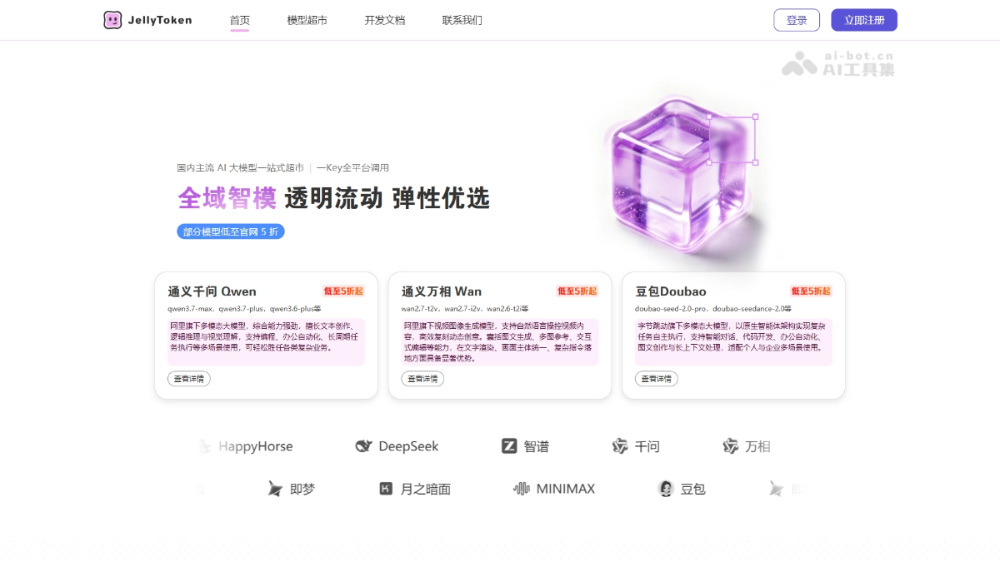
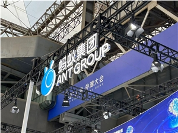
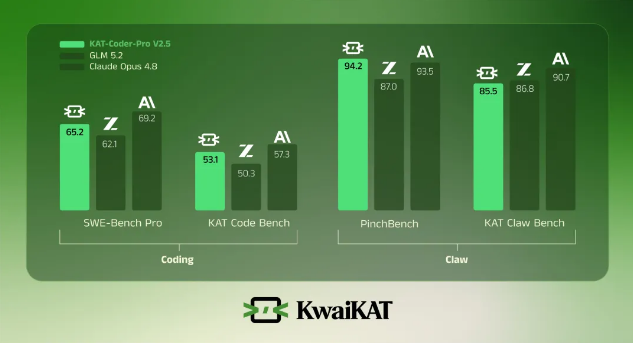
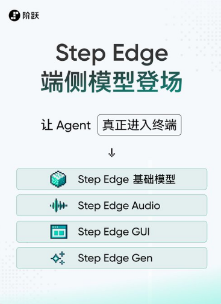
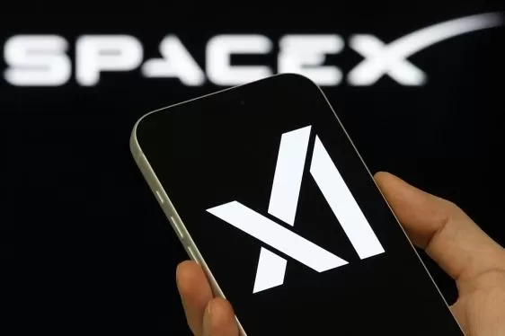

# 闪联AI周刊

---

## 🗓 本周概览

**时间范围：** 2026年6月30日 - 2026年7月13日

**本期编辑：** 产品资讯组

**核心摘要：** 近两周AI行业进入密集迭代期：OpenAI一口气发布GPT-5.6系列、GPT-Live全双工语音与企业级ChatGPT Work，正式将ChatGPT从对话助手升级为跨端自主执行平台；Anthropic推出Sonnet 5与Claude Science科研工作台，xAI则以半价Grok 4.5挑起新一轮价格战。国产阵营同样火热，快手KAT-Coder、智源RoboBrain Orca、阶跃星辰Step Edge、阿里JellyToken与蚂蚁安全护栏密集落地，覆盖编程Agent、世界模型、端侧多模态与安全治理。与此同时，企业侧曝出GPU利用率不足半数、多模型故障率被低估、评估手段跟不上Agent自主性等结构性挑战，AI基建过剩与落地失衡的讨论正在升温。

## 🚀 行业动态

### 7月13·周一

- **Anthropic推出Claude Science科研工作台**

    Anthropic正式发布面向科研人员的AI工作台Claude Science，该应用可定制化集成研究者常用的工具与软件包，生成可审计的研究成果，并提供灵活的计算资源接入。此举标志着Anthropic正式进军科研垂直领域，与OpenAI、Google等在科学AI赛道展开竞争，有望加速科研工作流的智能化转型。

    **使用说明：** 面向科研人员的AI工作台，可集成研究工具、生成可审计成果并接入灵活算力，适合实验数据分析与论文撰写。

- **Anthropic发布Claude Sonnet 5，前沿性能全面升级**

    Anthropic正式推出新一代模型Claude Sonnet 5，在编程、智能体任务及专业工作场景中实现前沿性能表现，并具备大规模应用能力。作为Claude系列的中端旗舰，Sonnet 5的发布进一步强化了Anthropic在企业级AI市场的竞争力，与OpenAI、Google的最新模型形成正面对抗，推动AI编码和Agent能力再上新台阶。

    **使用说明：** Claude系列中端旗舰模型，在编程、Agent任务与专业工作场景中提供前沿性能，适合企业级AI部署。

### 7月12·周日

- **Hugging Face携手Cerebras将Gemma 4带入实时语音AI**

    Hugging Face与Cerebras宣布合作，将谷歌最新的Gemma 4模型部署到Cerebras的高速推理平台上，用于驱动实时语音AI应用。该组合利用Cerebras芯片的超低延迟优势，使语音交互接近人类对话速度，为开发者构建实时语音助手、客服机器人等场景提供了新的高性能开源方案。

    **使用说明：** 基于Cerebras超低延迟推理平台运行Gemma 4，可打造接近人类对话速度的实时语音助手与客服机器人。

- **Anthropic披露Fable 5网络安全防护与越狱防御框架细节**

    Anthropic发布公告，详细介绍了Fable 5模型的网络安全防护措施及其越狱防御框架。该框架旨在系统化评估和抵御针对大模型的越狱攻击，提升模型在面对恶意提示时的鲁棒性与安全对齐能力。此举反映出前沿AI公司正加大对模型滥用风险的防御投入，为行业安全治理提供了可参考的技术范式。

### 7月11·周六

- **Hugging Face联手SkyPilot推出零出口费存储方案**

    Hugging Face与SkyPilot合作推出全新集成方案，让开发者可在任意云平台运行AI工作负载，同时将数据统一存储于Hugging Face，实现零出口流量费用。该方案打破了云厂商的数据锁定，显著降低跨云训练与推理的存储成本，为多云AI开发提供了更灵活、经济的基础设施选择。

    **使用说明：** 开发者可跨云运行AI工作负载并统一存储于Hugging Face，消除跨云数据出口费用，适合多云训练与推理。

- **OpenAI推出GPT-Live：全双工语音让ChatGPT更像真人对话**

    OpenAI发布语音能力升级版GPT-Live，引入全双工（full-duplex）交互模式，使ChatGPT可像真人一样在对话中同时听说、自然打断和实时回应。相比此前的半双工语音模式，新版本显著降低了延迟并提升了对话流畅度，标志着语音AI向更自然的人机交互体验迈进，也将加剧语音助手与实时AI Agent赛道的竞争。

    **使用说明：** 全双工语音升级版ChatGPT，可自然打断与实时回应，适合语音助手、口语陪练与实时Agent场景。

### 7月10·周五

- **英伟达开源智能体训练数据集，加速Agent生态发展**

    英伟达在HuggingFace上发布面向AI智能体的开源数据集'Data for Agents'，专为训练和评估Agent系统而设计。该举措为开发者提供了高质量的Agent行为数据，有助于降低智能体研发门槛，推动多步推理、工具调用等核心能力的进步，进一步完善开源Agent生态。

    **使用说明：** 面向Agent训练与评估的高质量开源数据集，助力开发者提升多步推理与工具调用能力。

- **vLLM原生速度Transformers建模后端发布**

    HuggingFace发布vLLM原生速度Transformers建模后端，将Transformers库与vLLM高性能推理引擎深度融合，使开发者可直接使用Transformers模型定义并获得接近原生vLLM的推理速度。此举降低了模型部署门槛，无需为高性能推理重写模型代码，有助于加速开源大模型在生产环境中的落地和推广。

    **使用说明：** 将Transformers模型定义直接对接vLLM高性能推理，无需重写代码即可获得原生级推理速度。

### 7月9·周四

- **Grok 4.5以半价上线，剑指Anthropic与OpenAI**

    xAI正式发布Grok 4.5，其定价仅为竞争对手同级模型的一半，主打高性价比推理能力。此举被视为对Anthropic和OpenAI旗舰模型的直接挑战，可能引发新一轮大模型价格战，加剧头部厂商在企业级API市场的竞争压力，重塑行业成本格局。

    **使用说明：** 以竞品一半价格提供高性价比推理能力，适合成本敏感的企业级API调用与大规模部署。

- **多模型部署风险被低估：企业AI故障率实际高出2.25倍**

    VentureBeat最新报道指出，采用多AI模型架构的企业正严重低估系统故障率，实际失败概率是预估值的2.25倍。随着企业普遍通过组合多个大模型来构建复杂应用，模型间的编排与协作带来的不确定性显著上升。该发现警示企业在推进多模型策略时需强化可靠性评估和故障容错设计，对AI编排工具及监控方案市场提出新需求。

- **OpenAI推出ChatGPT Work：跨邮件、Slack与日历的云端AI智能体**

    OpenAI发布面向企业办公场景的云端AI智能体ChatGPT Work，能够跨邮件、Slack和日历等主流协作工具自动执行任务并管理工作流。此举标志着OpenAI正式切入企业生产力市场，与微软Copilot、Google Workspace AI等展开正面竞争，也进一步推动AI Agent从概念走向规模化落地。

    **使用说明：** 可跨邮件、Slack与日历自动执行任务的云端AI智能体，适合企业办公自动化与工作流管理。

### 7月8·周三

- **企业AI陷入评估鸿沟：智能体自主性增速超越验证能力**

    VentureBeat指出，企业级AI正面临日益严重的"评估鸿沟"：AI智能体的自主决策与执行能力正快速提升，但企业现有的验证、测试和监控手段却难以跟上步伐。这一失衡使企业在部署智能体时面临可靠性、合规性和安全性风险，凸显了行业亟需建立更完善的评估框架与治理机制，以保障智能体在真实业务场景中的可信落地。

- **企业GPU利用率仅半数，AI基建过剩之争加剧**

    VentureBeat报道最新调查显示，高达86%的企业表示其GPU算力实际使用率不足50%，与华尔街正在热议的AI巨额资本开支形成鲜明对比。这一数据暴露出当前AI基础设施建设的效率困境：算力供给激增，但企业侧的编排、调度和落地能力尚未跟上，可能加剧市场对AI基建泡沫和ROI回报的担忧。

### 7月7·周二

- **谷歌推出TabFM：无需针对数据集训练即可预测新表格**

    谷歌发布表格基础模型TabFM，突破传统机器学习需针对每个数据集单独训练的限制，能够直接对从未见过的表格数据进行预测。该模型将基础模型范式引入结构化数据领域，有望大幅降低企业在表格类任务上的建模成本，为金融、零售等依赖表格数据的行业带来新的AI应用可能。

    **使用说明：** 表格基础模型，无需针对特定数据集训练即可预测新表格，适合金融、零售等结构化数据任务。

- **DeepSeek降价75%仍难解百倍成本难题**

    中国AI公司DeepSeek宣布将其模型API价格大幅下调75%，进一步加剧全球大模型价格战。然而分析指出，即便如此激进的降价，DeepSeek与顶级闭源模型之间仍存在约百倍的推理成本差距这一根本性问题尚未解决。此举反映出开源模型在成本效率上的持续突破，也凸显了整个行业在推理经济性上的深层挑战。

### 7月6·周一

- **OpenAI发布GPT-5.6系列：Sol登顶智能体评测**

    OpenAI正式推出GPT-5.6大语言模型系列，包含旗舰款Sol、均衡款Terra和性价比款Luna三款产品，API价格覆盖每百万token 1至30美元。在Agents' Last Exam评测中，Sol以53.6分超越Claude Fable 5达13.1分，编程智能体指数创下80分新高，同时在成本与耗时上大幅降低，进一步巩固OpenAI在智能体领域的领先地位。

    **使用说明：** GPT-5.6系列三款模型覆盖不同价位，Sol智能体评测领先，适合编程Agent与复杂推理任务。

- **OpenAI 发布 ChatGPT Work，进军企业级智能体工作台**

    OpenAI 推出全新智能体产品 ChatGPT Work，由 Codex 与 GPT-5.6 驱动，定位为可承担长时间、多步骤任务的工作智能体。用户只需一条指令描述目标，AI 即可接管整个工作流，跨网页、移动和桌面端调用应用与文件上下文，自动生成文档、幻灯片、分析报告和网站。此举标志着 OpenAI 正式将 ChatGPT 从对话助手升级为面向办公场景的自主执行平台。

    **使用说明：** 由Codex与GPT-5.6驱动的工作智能体，可一键接管长时多步任务，跨端生成文档、报告和网站。

### 7月5·周日

- **OpenAI发布GPT-Live语音模型，支持全双工对话与后台任务委托**

    OpenAI推出新一代语音交互模型GPT-Live，具备实时同声传译与全双工对话能力，用户可随时打断插话。该模型支持自定义推理强度，并引入深度任务委托机制：前台保持流畅语音交互，后台可并行执行联网搜索、复杂推理等任务，还能在对话中实时弹出天气、赛事等可视化卡片，标志着语音AI向多模态智能助手迈进。

    **使用说明：** 支持全双工对话与实时打断的语音模型，前台流畅交互同时后台并行执行搜索与推理任务。

- **阿里元境推出JellyToken：一站式聚合60余款国产大模型**

    阿里元境正式发布AI大模型聚合平台JellyToken（智渲云），开发者仅需一个API Key即可调用通义千问、DeepSeek、豆包、智谱、月之暗面等60余款国产大模型，覆盖文本、图像、视频、音频四大场景。平台提供智能路由、负载均衡、Token级计费及正规发票等企业级能力，显著降低多模型接入门槛与运维成本，加速国产大模型在企业侧的规模化落地。

    **使用说明：** 一个API Key即可调用60余款国产大模型，涵盖文图音视四类场景，适合多模型企业接入。

### 7月4·周六

- **智源发布悟界·RoboBrain Orca多模态世界模型**

    智源研究院推出悟界·RoboBrain Orca多模态表征世界模型，通过12.5万小时视频进行无意识学习，并结合1.6亿条事件标注进行有意识学习，构建统一的世界潜在表征空间。在文本生成、图像预测和具身动作生成等下游任务中，其表现优于同等规模基线模型，为具身智能和世界模型研究提供新范式。

    **使用说明：** 多模态世界模型，构建统一潜在表征空间，适合具身智能、机器人预测与动作生成研究。

- **蚂蚁开源两款AI安全护栏，为大模型与智能体戴上'紧箍咒'**

    蚂蚁AI安全实验室连发两款开源安全模型：智能体安全护栏SingGuard-NSFA和多模态安全护栏SingGuard，分别针对自主执行智能体和多模态大模型的安全风险。此举标志着蚂蚁在AI安全领域完成系统化布局，将防护范围从模型输出扩展至行为控制、权限管理和系统治理层面，为智能体时代的AI安全治理提供开源方案。

    **使用说明：** 开源智能体安全护栏与多模态安全模型，为Agent行为控制、权限管理提供治理方案。

- **快手发布 KAT-Coder-Pro V2.5：国产首个端到端 Agentic 编程模型**

    快手 KwaiKAT 团队推出旗舰 Agentic Coding 模型 KAT-Coder-Pro V2.5，主打端到端跑通完整工程的能力，直击"跑分高落地差"痛点。该模型升级了长程工程能力、通用 Agentic 能力及大规模强化学习体系，并自研 AutoBuilder 流水线将真实仓库环境转化为训练支撑，推动 AI 编程从代码补全迈向独立完成软件工程与复杂业务流。

    **使用说明：** 国产端到端Agentic编程模型，可独立跑通完整工程，适合复杂软件开发与业务流自动化。

### 7月3·周五

- **阶跃星辰发布Step Edge终端模型系列，实现端侧多模态处理**

    阶跃星辰推出面向手机、车载等终端设备的Step Edge系列模型，涵盖基础版、Audio版、GUI版和Gen版，支持本地处理图文音频，可实现屏幕理解、语音识别、界面操作与图像生成，工具调用延迟低至0.1秒。该系列采用端云协同架构，简单高频或弱网任务本地完成，复杂推理交由云端，标志着国内端侧多模态大模型能力进入新阶段。

    **使用说明：** 面向手机、车载的端侧多模态模型系列，支持屏幕理解、语音识别与端云协同任务分发。

- **xAI发布Grok 4.5，马斯克称其为Opus级模型**

    xAI推出上市以来首款新模型Grok 4.5，定位为处理编程、应用开发、文书、研究和写作等知识型工作的"主力马"。官方称其令牌效率是其他领先模型的两倍，可在更低成本下完成同等任务。马斯克将其比作Anthropic的Claude Opus级别模型，显示xAI正加速追赶头部厂商。

    **使用说明：** 定位知识工作主力模型，令牌效率号称是主流模型两倍，适合编程、研究与写作场景。

### 7月2·周四

- **GPT-5.6发布之际，OpenAI安全主管离职引关注**

    OpenAI最新模型GPT-5.6刚刚发布，公司安全主管随即宣布离职，引发行业广泛关注。此前OpenAI已有多位安全相关高管相继出走，外界担忧其在追求模型能力快速迭代的同时，安全治理与对齐研究是否被边缘化。此次人事变动或将进一步加剧公众和监管层对AI前沿实验室安全文化的质疑。

- **苹果豪掷40万美元留任奖金，筑墙防OpenAI挖角iPhone设计师**

    彭博记者Mark Gurman爆料，苹果近期向iPhone产品设计团队发放最高达40万美元的股票形式特别留任奖金，旨在构筑经济壁垒，防止核心硬件人才被OpenAI、Meta等AI巨头挖走。此举反映出AI浪潮下硬件设计人才的稀缺性正急剧上升，尤其在OpenAI收购Jony Ive创办的io公司后，苹果的设计护城河正面临前所未有的挑战。

### 7月1·周三

- **马斯克官宣特斯拉AI6芯片12月流片，单芯片性能媲美双AI5**

    特斯拉CEO马斯克宣布，第六代自研AI芯片AI6将于今年12月前完成流片，得益于AI辅助设计大幅加速研发进程。马斯克表示，在相同工艺节点下，单颗AI6性能可媲美双AI5芯片系统，效率翻倍。特斯拉软硬件协同优化，全栈AI软件针对电路效率进行深度调校。此举标志着特斯拉在自动驾驶和机器人算力自主化道路上再进一步，也加剧了与英伟达等厂商的竞争。

- **Anthropic免费升级Claude：额度翻倍，Opus 4.7成默认**

    Anthropic宣布对其生产力工具生态进行重大升级，视觉创作工具Claude Design在所有订阅套餐中令牌限制翻倍，且不额外收费。同时，Claude Code的"快速模式"默认切换至最新的Opus 4.7模型。此次调整针对专业用户在设计生成、原型制作及多源导入中频繁遭遇上下文中断的痛点，进一步强化Claude在生产力和创意工作流中的竞争力。

    **使用说明：** Claude Design令牌额度翻倍，Claude Code快速模式默认Opus 4.7，缓解设计与编程上下文中断痛点。

### 6月30·周二

- **腾讯开源Hy-MT翻译模型：440MB离线超越谷歌**

    腾讯正式开源紧凑型AI翻译模型Hy-MT1.5-1.8B-1.25bit，采用1.25比特量化技术将模型体积从3.3GB压缩至440MB，可在智能手机上完全离线运行。该模型支持33种语言及5种方言，覆盖1056种翻译方向，并在国际机器翻译竞赛中30次夺冠，性能超越谷歌翻译，为端侧AI翻译树立新标杆。

    **使用说明：** 1.25比特量化压缩至440MB的离线翻译模型，支持33种语言1056种方向，可在手机端本地运行。

- **UST携手Anthropic：Claude赋能物理AI落地**

    技术服务公司UST宣布将Anthropic的Claude模型引入物理AI领域，用于驱动机器人、工业自动化等实体设备的智能化升级。该合作展示了大语言模型从数字世界向物理世界延伸的新趋势，Claude的推理与理解能力有望提升机器人在复杂环境下的决策水平，为智能制造和企业自动化提供新范式。

    **使用说明：** 将Claude能力引入机器人与工业自动化设备，为智能制造、复杂环境决策提供新范式。

## 📈 本周AI技术总结：三大趋势

### ☀️ 核心趋势

25. **Agent从对话助手升级为自主工作平台**

    OpenAI ChatGPT Work、Anthropic Claude Science、快手KAT-Coder等密集发布，AI正从单轮对话走向跨应用、长时程、多步骤的自主执行。企业级Agent工作台开始承担邮件、日历、编程、科研等真实工作流，标志着大模型商业化进入以'完成任务'为核心的新阶段。

26. **全双工语音与多模态世界模型齐头并进**

    GPT-Live引入全双工对话、实时打断与后台任务委托，语音AI逼近真人交互；智源RoboBrain Orca、阶跃Step Edge则将多模态能力延伸至具身智能与端侧设备。从云端到边缘，从语音到视觉动作，AI正构建更贴近物理世界的统一感知与决策能力。

21. **算力过剩与评估鸿沟浮出水面**

    86%企业GPU利用率不足50%，多模型架构真实故障率超预估2.25倍，Agent自主性提升速度已超出验证能力。伴随Grok 4.5、DeepSeek激进降价，行业焦点正从'堆算力、卷参数'转向编排效率、可靠性评估与推理经济性，AI基建ROI之争进入深水区。

### 🔮 可行性思考

25. **企业级Agent工作流落地**

    - **办公自动化：** 借助ChatGPT Work或KAT-Coder-Pro，将邮件回复、报告生成、代码工程等长任务交由Agent接管
    - **多模型路由：** 通过JellyToken等聚合平台按场景调用国产大模型，降低接入与运维成本
    - **可靠性优先：** 需配套多模型故障监控与评估框架，避免自主执行带来的合规与稳定性风险

26. **语音与端侧多模态应用**

    - **实时语音客服：** 基于GPT-Live或Gemma 4+Cerebras方案构建低延迟全双工语音助手
    - **端侧智能：** 用Step Edge、Hy-MT等端侧模型实现离线翻译、屏幕理解与本地语音识别
    - **端云协同：** 高频弱网任务本地跑，复杂推理走云端，兼顾体验与成本

30. **AI安全与治理体系建设**

    - **Agent安全护栏：** 引入蚂蚁SingGuard等开源方案，管控自主智能体的行为与权限
    - **越狱防御：** 参考Anthropic Fable 5安全框架，系统化评估模型对抗恶意提示的鲁棒性
    - **评估补齐：** 针对'评估鸿沟'建立多模型编排的验证、测试与监控机制，保障可信落地
