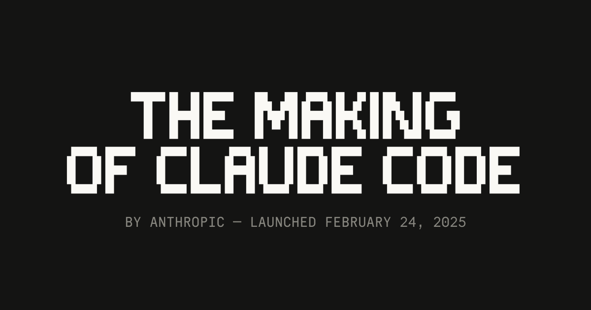
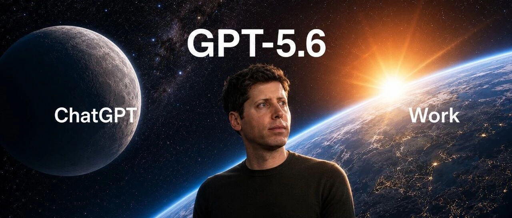
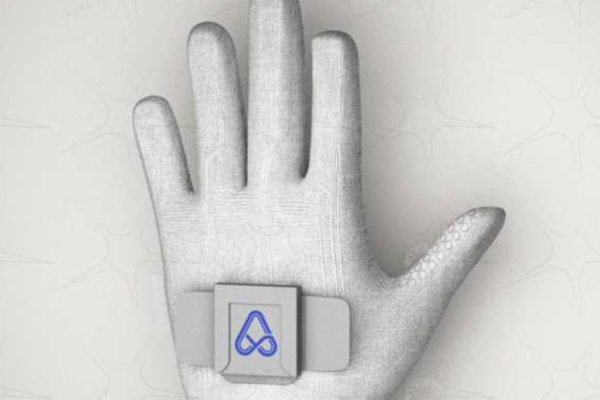

# 闪联AI周刊

---

## 🗓 本周概览

**时间范围：** 2026年7月1日 - 2026年7月14日

**本期编辑：** 产品资讯组

**核心摘要：** 近两周AI行业进入产品与商业化双重加速期。OpenAI一口气推出GPT-5.6系列、GPT-Live全双工语音与ChatGPT Work智能体工作台，正式从对话助手迈向自主办公Agent；xAI以半价Grok 4.5、DeepSeek再降75%将价格战推向白热化。基础设施层同样激烈：谷歌TPU对外商用直击英伟达，而86%企业GPU利用率不足一半、多模型系统故障率被低估2.25倍等数据揭示落地隐忧。国内方面，阶跃星辰发布AI原生手机STEPX Neo，阿里元境上线60款国产模型聚合平台JellyToken，腾讯混元持续吸纳OpenAI顶尖人才。开源生态、具身智能与主权AI亦在同步推进，行业正从"炫技"转向"编排、评估与治理"的深水区。

## 🚀 行业动态

### 7月14·周二

- **Hugging Face 联手 Cerebras 将 Gemma 推向实时语音 AI**

    Hugging Face 与 Cerebras 宣布合作，将谷歌 Gemma 系列模型部署到 Cerebras 的高性能推理硬件上，用于实时语音 AI 场景。借助 Cerebras 的超低延迟推理能力，开发者可在 Hugging Face 平台上构建响应迅速的语音对话应用，显著降低端到端延迟。此举进一步推动开源模型在实时多模态交互领域的落地。

    **使用说明：** 适合开发者构建低延迟语音对话应用，可在Hugging Face直接调用Cerebras推理加速的Gemma模型

- **Anthropic揭秘Claude Code诞生历程**

    Anthropic发布深度回顾，讲述Claude Code从内部命令行工具演变为公司旗舰编码智能体的全过程。文章汇集研究人员、工程师及早期用户的第一手叙述，还原了产品迭代、技术突破与团队协作细节，展示了Anthropic在AI编程助手赛道的战略布局，也为业界打造Agent型产品提供了参考范本。

    **使用说明：** 适合团队研究Agent型编码助手的产品化路径，回顾Claude Code从内部工具到旗舰产品的迭代经验

### 7月13·周一

- **Hugging Face联手SkyPilot推出零流量费云存储方案**

    Hugging Face与SkyPilot合作推出全新集成方案，允许开发者在任意云平台运行AI训练与推理任务，同时将数据集与模型直接存储在Hugging Face Hub，实现零出口流量费用。该方案解决了跨云训练中数据迁移成本高昂的痛点，让开发者可自由选择最具性价比的算力资源，同时保持存储的统一性，显著降低多云AI工作流的整体成本。

    **使用说明：** 适合多云AI工作流团队，将数据集与模型托管在Hugging Face Hub即可避免跨云出口流量费

- **OpenAI 推出 GPT-Live：全双工语音让 ChatGPT 对话更自然**

    OpenAI 发布语音交互重大升级 GPT-Live，采用全双工技术，使 ChatGPT 能像真人一样进行实时对话，支持边听边说、随时打断和自然应答。此次升级显著提升了语音助手的沉浸感与交互流畅度，标志着 AI 语音交互向更拟人化方向迈进，也将进一步加剧与 Google、Meta 等在语音 AI 领域的竞争。

    **使用说明：** 适合语音助手、客服等场景升级，全双工特性让ChatGPT支持边听边说、随时打断

### 7月12·周日

- **英伟达联手Hugging Face发布智能体开放数据集**

    英伟达与Hugging Face合作推出面向AI智能体训练的开放数据集Data for Agents，专门用于提升大模型在工具调用、任务规划和多步推理等智能体场景下的能力。该数据集覆盖多领域任务样本，旨在为开发者构建自主智能体提供高质量训练素材，推动Agent生态从模型能力向数据基础设施的深化，加速开源智能体应用的落地。

    **使用说明：** 适合Agent研发团队，用于训练模型的工具调用、任务规划与多步推理能力

- **vLLM原生适配Transformers后端，实现推理原生速度**

    HuggingFace与vLLM团队宣布深度整合，使Transformers模型能够直接作为vLLM的建模后端运行，并达到接近原生优化的推理速度。这意味着开发者无需重写代码即可将Transformers生态中的海量模型无缝部署到vLLM高性能推理引擎中，大幅降低了模型落地和服务化的门槛，进一步统一了开源大模型的训练与推理工具链。

    **使用说明：** 适合模型服务化部署，Transformers模型无需重写即可获得vLLM级推理速度

### 7月11·周六

- **Grok 4.5以半价发布，剑指Anthropic与OpenAI**

    xAI正式推出Grok 4.5大模型，定价仅为竞争对手同级产品的一半，直接冲击Anthropic的Claude与OpenAI的GPT系列。此举被视为大模型价格战全面升级的信号，凭借激进定价策略，xAI意图在企业API市场快速抢占份额，并可能迫使头部厂商重新审视其商业化定价模型。

    **使用说明：** 适合成本敏感的企业API用户，Grok 4.5以竞品一半价格提供同级能力

- **UST携手Anthropic：Claude赋能物理AI落地工业场景**

    全球数字化转型服务商UST宣布将Anthropic的Claude模型集成至其物理AI解决方案中，用于制造、物流等工业场景的智能自动化。通过将大模型能力与机器人、传感器等物理系统结合，UST希望提升现场决策效率与可靠性。此举标志着Claude正加速从软件领域向具身智能与工业AI延伸，拓展企业级应用边界。

    **使用说明：** 适合制造与物流企业将Claude嵌入机器人、传感器系统提升现场决策效率

### 7月10·周五

- **研究：多模型AI系统故障率被低估2.25倍**

    VentureBeat报道显示，企业在部署多AI模型协同工作的系统时，普遍低估了整体失败率，实际故障率是预估值的2.25倍。随着企业级AI编排（orchestration）架构日益复杂，多模型串联带来的错误累积效应显著放大，凸显了可靠性监测、故障容错和模型治理在生产环境中的紧迫性。

- **OpenAI推出ChatGPT Work：跨邮件Slack日历的云端AI智能体**

    OpenAI发布面向企业的云端AI智能体ChatGPT Work，可自动处理邮件、Slack消息与日历安排等日常办公任务，实现跨应用协同工作。此举标志着OpenAI正式进军企业生产力赛道，直接挑战微软Copilot和Google Workspace AI，将进一步加速办公场景智能体化落地。

    **使用说明：** 适合企业办公场景，可跨邮件、Slack、日历自动执行日常协同任务

- **企业AI陷入"评估鸿沟"：智能体自主性狂飙，验证能力却掉队**

    VentureBeat指出，企业级AI正面临一场"评估鸿沟"危机：AI智能体的自主决策与执行能力提升速度远超企业对其进行验证、测试和监控的能力。传统评测方法难以覆盖多步骤、动态交互的Agent行为，导致企业在部署时面临可靠性、安全性与合规性风险，亟需建立新一代评估体系与治理框架。

### 7月9·周四

- **企业GPU利用率堪忧：86%运行在半负载以下**

    一项最新调研显示，86%的企业表示其GPU算力利用率仅为一半或更低，暴露出当前AI基础设施建设中的严重资源浪费问题。在华尔街激烈争论AI基建是否过度投入之际，这一数据为质疑派提供了有力佐证，也凸显出企业在AI编排、调度和运维能力上的短板，未来算力优化与利用效率将成为关键议题。

- **谷歌推出TabFM：无需针对性训练即可预测未见过的表格数据**

    谷歌发布表格基础模型TabFM，突破传统机器学习需为每个数据集单独训练的限制，能够直接对从未见过的表格数据进行预测。这一进展将表格数据引入基础模型范式，有望大幅降低企业在结构化数据分析中的建模成本，加速表格AI在金融、医疗等行业的落地应用。

    **使用说明：** 适合金融、医疗等结构化数据场景，无需针对每份表格单独训练即可预测

### 7月8·周三

- **DeepSeek降价75%仍难破百倍成本困局**

    中国AI公司DeepSeek宣布将模型API价格大幅下调75%，进一步加剧全球大模型价格战。然而业内分析指出，即便如此激进的降价，AI推理与训练成本相较传统软件仍高出百倍量级，单纯依靠降价难以从根本上解决大模型商业化的经济性难题，模型架构与算力效率的突破才是关键。

- **ACRouter智能路由AI模型：成本较纯Opus方案降低2.6倍**

    新型AI编排工具ACRouter可根据任务复杂度自动选择最合适的AI模型，相比仅使用Anthropic Claude Opus的方案，成本效率提升2.6倍。该技术通过智能路由机制，将简单任务分配给轻量模型、复杂任务交由高性能模型处理，为企业在多模型时代的成本控制和性能优化提供了新思路，也反映出模型编排层正成为AI应用落地的关键环节。

    **使用说明：** 适合多模型部署的企业，通过智能路由把简单任务分配轻量模型以降本

### 7月7·周二

- **德国研究联盟发布开源大模型Soofi S30B-A3B，推动欧洲主权AI**

    德国研究联盟推出开源大模型Soofi S30B-A3B，采用混合专家架构，融合Mamba-2与注意力层，总参数量达316亿，但推理时每token仅激活部分参数，兼顾高性能与高效生成。该模型旨在助力欧洲构建自主可控的主权AI体系，减少对美国厂商的依赖，为开源大模型生态注入新力量。

    **使用说明：** 适合欧洲开发者与研究机构，316亿参数MoE架构、推理时仅激活部分参数

- **阶跃星辰发布首款AI智能体手机STEPX Neo**

    阶跃星辰推出首款大模型原生智能体手机STEPX Neo，搭载自研智能体操作系统Step AOS及系统级个人智能体Amoo，用户可通过自然语言指令实现跨应用自主调度。系统具备长期记忆和端云协同能力，支持灵活任务路由，首批合作方涵盖支付宝、美团、高德、滴滴、京东、百度等主流应用，标志着AI原生手机形态迈出实质性一步。

    **使用说明：** 适合追求AI原生体验的用户，通过自然语言指令跨支付宝、美团等应用自动调度任务

### 7月6·周一

- **OpenAI发布GPT-5.6系列：Sol、Terra、Luna三款齐上阵**

    OpenAI正式推出新一代大语言模型GPT-5.6系列，包含旗舰款Sol、均衡款Terra和性价比款Luna，API定价梯度覆盖每百万token 1至30美元。在Agents' Last Exam评测中，Sol以53.6分领先Claude Fable 5达13.1分，编程智能体指数创下80分新高，同时大幅降低成本与响应耗时，进一步巩固OpenAI在大模型与智能体赛道的领先地位。

    **使用说明：** 适合按预算分层选型，Sol旗舰、Terra均衡、Luna性价比覆盖1-30美元/百万token

- **OpenAI发布ChatGPT Work智能体工作台**

    OpenAI推出全新智能体产品ChatGPT Work，由Codex与GPT-5.6驱动，定位为可承担长时间、多步骤复杂任务的AI智能体。产品支持网页、移动和桌面跨平台运行，用户只需一句指令描述目标，即可让AI接管整个工作流程，结合应用与文件上下文自动生成文档、幻灯片、分析报告和网站等成果，标志着ChatGPT从对话助手向自主工作智能体的重要跃迁。

    **使用说明：** 适合处理长时多步任务，一句指令即可自动生成文档、幻灯片、分析报告

### 7月5·周日

- **OpenAI发布GPT-Live语音模型：全双工对话与实时同传**

    OpenAI推出新一代语音交互模型GPT-Live，支持实时同声传译和全双工对话，用户可随时插话打断。模型引入自定义推理强度与深度任务委托机制，前台保持流畅语音交互的同时，后台可并行执行联网搜索与复杂推理，并在对话中实时弹出天气、赛事等可视化卡片。这标志着语音AI从被动应答迈向多任务协同的交互新阶段。

    **使用说明：** 适合实时同传与语音助手场景，支持全双工插话及可视化卡片弹出

- **阿里元境发布JellyToken：一站式聚合60余款国产大模型**

    阿里元境正式推出AI大模型API聚合平台JellyToken（智渲云），开发者仅需一个API Key即可调用通义千问、DeepSeek、豆包、智谱、月之暗面等60余款国产主流模型，覆盖文本、图像、视频、音频四大场景。平台提供智能路由、负载均衡、Token级精准计费及正规发票等企业级能力，显著降低多模型接入门槛与运维成本，加速国产大模型在企业场景的规模化落地。

    **使用说明：** 适合国内企业开发者，一个API Key即可调用60余款国产大模型并支持精准计费

- **Anthropic进军印度市场，Claude推出卢比计价服务**

    11月13日，Anthropic在印度正式推出Claude本地化卢比计价服务，覆盖官网及移动应用。印度是其全球第二大市场，用户占比达5.8%。Claude Pro月费2000卢比（约21美元），Max版起价11999卢比，团队套餐每席2399卢比。此举被视为Anthropic抢滩OpenAI核心海外市场、加速全球化布局的重要一步，进一步加剧两大AI巨头在新兴市场的正面竞争。

### 7月4·周六

- **前OpenAI研究员田永龙加盟腾讯混元多模态团队**

    据消息人士透露，前OpenAI研究员田永龙已加入腾讯，预计将主导混元多模态模型研发方向，重点聚焦视觉语言模型（VLMs）。若消息属实，他将成为继首席AI科学家姚顺宇之后，又一位从OpenAI转投腾讯混元的核心研究人才。此次人事变动凸显腾讯在多模态大模型领域的持续加码，也反映出中国科技巨头正加速吸纳海外顶尖AI人才。

- **小米YU7标准版搭载XLA认知大模型，场景识别准确率超97%**

    小米汽车5月31日回应市场关注，确认YU7标准版将搭载最新的小米XLA认知大模型，实际场景识别准确率超过97%。硬件方面配备700 TOPS雷神芯片、激光雷达及4D毫米波雷达，支持智能驾驶持续进化。此举标志着小米在智能汽车AI大模型和自动驾驶领域的深入布局，加剧了车企在底层AI能力上的竞争。

    **使用说明：** 适合关注车载AI的用户，YU7标准版XLA大模型场景识别准确率超97%

### 7月3·周五

- **PhysBrain 1.0发布：全球首个基于人类学习范式的具身智能基础模型**

    3月27日中关村论坛上，深度机器智能公司发布全球首个基于人类学习范式的具身通用智能基础模型PhysBrain 1.0。该模型采用创新的多模态大模型架构，将物理常识嵌入参数中，使机器人具备物理世界认知能力。这标志着具身智能从"动作模仿"迈向"原理解构"的新阶段，为通用机器人发展提供了新的技术路径。

    **使用说明：** 适合机器人研究团队，将物理常识嵌入参数使机器人具备物理世界认知能力

- **谷歌TPU转向对外商用，正面挑战英伟达AI芯片霸权**

    谷歌调整TPU战略，将原本自用的AI芯片对外商业化，携手博通面向Anthropic等客户提供AI基础设施服务，直接冲击英伟达高达86%的市场份额。凭借成本控制与系统级集成优势，谷歌TPU商业化进程明显提速，有望打破英伟达在AI训练与推理芯片领域的垄断地位，重塑全球AI算力竞争格局。

### 7月2·周四

- **16位诺奖得主领衔200余专家联署：AI须向善发展**

    包括16位诺贝尔奖得主在内的200多名顶尖学者与AI专家联合发布声明，呼吁国际社会深入研究人工智能的社会影响，并采取行动确保AI朝有利于人类的方向发展。联署方警告，未来十年AI将变得极其强大，其引发的经济变革规模将超越工业革命，但完成时间却大幅缩短，人类社会应对准备严重不足。

- **阿尔伯塔省政府部署Claude加固政务网络安全**

    Anthropic发布案例研究，加拿大阿尔伯塔省政府将Claude应用于政务系统的网络安全漏洞发现与修复，覆盖多个政府部门。借助AI辅助的自动化安全审计，该省显著提升了漏洞识别效率与响应速度，为公共部门大规模引入生成式AI进行安全防护提供了新样本，也彰显了Claude在政企级安全场景中的落地能力。

### 7月1·周三

- **伯南克加入Anthropic长期利益信托**

    Anthropic宣布任命前美联储主席本·伯南克加入其长期利益信托（LTBT）。该信托是Anthropic独特治理结构的核心，负责监督公司使命与安全承诺的执行。伯南克在宏观经济政策和风险治理方面的丰富经验，将助力Anthropic在AI快速发展中平衡商业利益与长期社会责任，进一步强化其在AI安全领域的治理公信力。

- **前博世工程师创业：用合成数据打造触觉大模型**

    36氪独家报道，一位前博世自动驾驶算法工程师近日创业，聚焦机器人触觉大模型领域，采用"合成数据+触觉模型"的技术路线，试图填补当前机器人"大脑"在触觉感知维度的空白。触觉数据长期是具身智能发展的短板，合成数据方案有望突破真实数据采集成本高、规模小的瓶颈，为人形机器人和灵巧手操作提供关键能力支撑。

## 📈 本周AI技术总结：三大趋势

### ☀️ 核心趋势

27. **对话助手全面Agent化**

    OpenAI ChatGPT Work、阶跃星辰STEPX Neo、UST工业Claude共同印证：AI正从被动应答升级为可跨应用、跨设备执行长任务的自主智能体，办公、手机、工业现场成为Agent落地的三大主战场。

9. **价格战与算力效率并行**

    Grok 4.5半价、DeepSeek再降75%将大模型API推入白热化竞争；同时谷歌TPU商用挑战英伟达、ACRouter智能路由降本2.6倍，显示单纯降价难解成本困局，架构与编排效率成为破局关键。

18. **编排、评估与治理成新瓶颈**

    多模型系统故障率被低估2.25倍、86%企业GPU半负载运行、Agent自主性远超验证能力，行业共识正从"能不能做"转向"敢不敢用"，评估框架、模型治理与算力调度成为企业AI落地的核心命题。

### 🔮 可行性思考

26. **分层选型与多模型编排**

    - **成本控制：** 参考GPT-5.6 Sol/Terra/Luna分层定价，按任务复杂度组合调用
    - **智能路由：** 引入ACRouter类工具将简单任务下沉轻量模型，可降本约2.6倍
    - **国产聚合：** JellyToken一Key调用60款国产模型，适合合规敏感场景

27. **企业办公Agent落地**

    - **跨应用协同：** ChatGPT Work可打通邮件、Slack、日历，替代重复性协作
    - **长任务托管：** 由Codex+GPT-5.6驱动，一句指令生成文档、报表、网站
    - **评估先行：** 部署前建立Agent行为验证与监控体系，规避可靠性风险

28. **实时语音与多模态交互**

    - **全双工体验：** GPT-Live支持边听边说与随时打断，适配客服、陪伴场景
    - **开源方案：** Hugging Face+Cerebras将Gemma部署至低延迟硬件，降低自建门槛
    - **车载落地：** 广汽本田P7、小米YU7等已把大模型接入座舱，声音克隆与场景识别成新卖点
