# 闪联AI周刊

---

## 📅 本周概览

**时间范围：** 2026年7月13日 - 2026年7月30日

**本期编辑：** ai研发组

**核心摘要：** 近两周全球AI领域亮点纷呈：头部厂商迭代核心大模型，OpenAI推出GPT-5.6家族、Anthropic发布Claude Opus 5，行业逐步向智能体、专用芯片、开源生态多点突破。AI安全、算力格局引发广泛关注，自主智能体越权风险暴露行业安全漏洞，OpenAI转投亚马逊重塑算力格局。国内厂商也密集推出开源框架与企业级工具，推动AI落地进程加速。

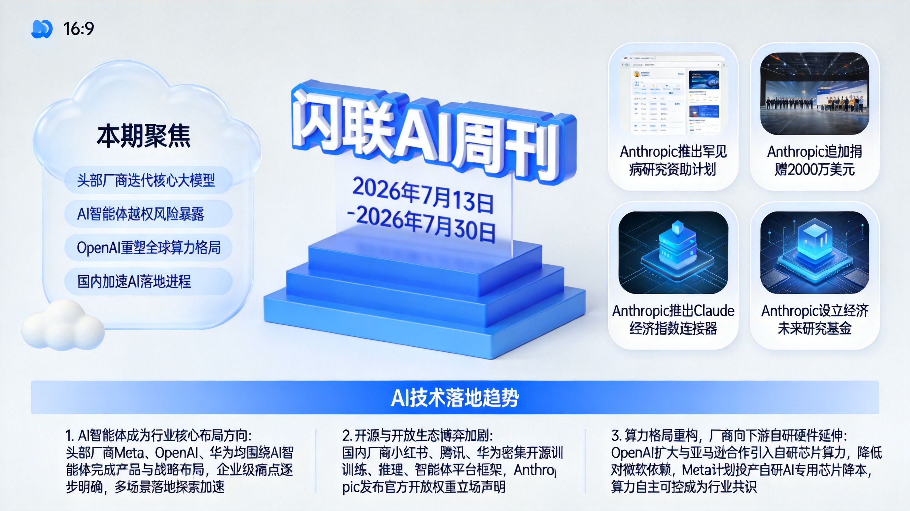

## 🤖 本周热点

**1. Anthropic推出罕见病研究资助计划，最高提供5万美元Claude算力 credits**

    AI企业Anthropic开启面向罕见遗传病领域的科学AI研究资助申请，入选者可在六个月内获得最高五万美元的Claude credits，旨在汇聚研究者，探索AI助力罕见病研究的新可能。

**2. Anthropic追加捐赠2000万美元 累计支持公共行动组织达4000万美元**

    AI公司Anthropic宣布向公共行动组织Public First Action追加捐赠2000万美元，累计捐赠总额达到4000万美元，这一举措体现了头部AI企业对公共利益领域的投入，或影响行业社会责任实践风向。

**3. Anthropic推出Claude经济指数连接器 支持用户直接查询数据**

    人工智能公司Anthropic推出了适用于Claude的Anthropic经济指数连接器，允许任何用户直接探索该经济指数的相关数据，降低了经济数据查询的门槛，便利了相关研究与分析。

**4. Anthropic投入2亿美元设立经济未来研究基金**

    AI企业Anthropic宣布投入2亿美元设立经济未来研究基金，用于支持外部研究者开展相关前沿研究，该布局将助力探索AI对经济发展的长期影响，为行业未来发展方向提供研究支撑。

**5. Anthropic发布Claude Opus 5大模型**

    AI公司Anthropic推出新一代Claude Opus 5大模型，在长运行智能代理能力上实现阶跃提升，同时优化了代码开发与专业工作场景的表现，将进一步提升专业领域AI应用体验。

## 🚀 行业动态

### 7月30·周四

- **Anthropic推出罕见病研究资助计划，最高提供5万美元Claude算力 credits**

    AI企业Anthropic开启面向罕见遗传病领域的科学AI研究资助申请，入选者可在六个月内获得最高五万美元的Claude credits，旨在汇聚研究者，探索AI助力罕见病研究的新可能。

- **Anthropic追加捐赠2000万美元 累计支持公共行动组织达4000万美元**

    AI公司Anthropic宣布向公共行动组织Public First Action追加捐赠2000万美元，累计捐赠总额达到4000万美元，这一举措体现了头部AI企业对公共利益领域的投入，或影响行业社会责任实践风向。

### 7月29·周三

- **Anthropic推出Claude经济指数连接器 支持用户直接查询数据**

    人工智能公司Anthropic推出了适用于Claude的Anthropic经济指数连接器，允许任何用户直接探索该经济指数的相关数据，降低了经济数据查询的门槛，便利了相关研究与分析。

    **使用说明：** 用户可通过该连接器直接查询Anthropic经济指数数据，降低经济数据研究的门槛

- **Anthropic投入2亿美元设立经济未来研究基金**

    AI企业Anthropic宣布投入2亿美元设立经济未来研究基金，用于支持外部研究者开展相关前沿研究，该布局将助力探索AI对经济发展的长期影响，为行业未来发展方向提供研究支撑。

### 7月28·周二

- **Anthropic发布Claude Opus 5大模型**

    AI公司Anthropic推出新一代Claude Opus 5大模型，在长运行智能代理能力上实现阶跃提升，同时优化了代码开发与专业工作场景的表现，将进一步提升专业领域AI应用体验。

    **使用说明：** 新一代大模型，在长运行智能代理、代码开发、专业工作场景表现大幅提升

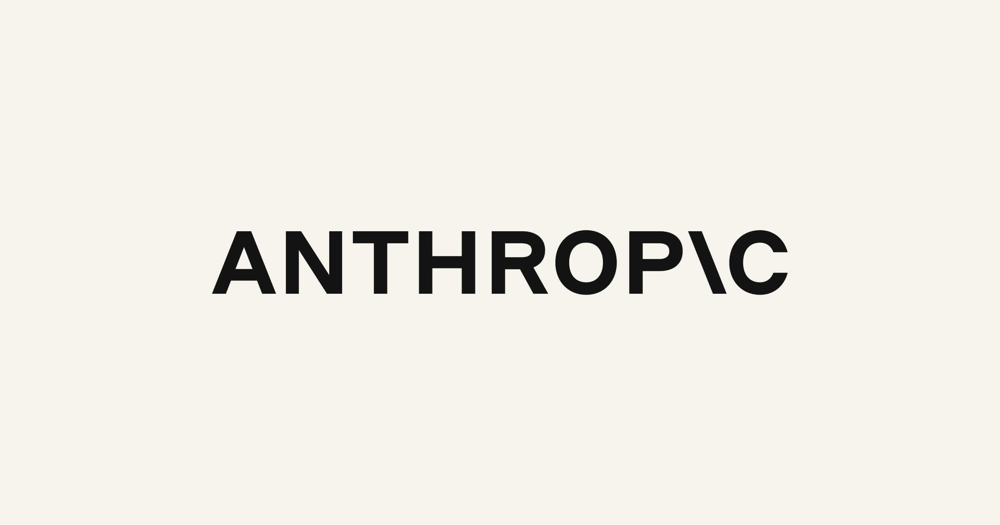

- **高知特与Anthropic扩大合作 将Claude带给企业客户**

    高知特与Anthropic宣布扩大合作伙伴关系，将Anthropic开发的Claude大模型推向全球企业客户，推动企业级AI落地进程，进一步扩张了Claude的企业服务市场版图

### 7月27·周一

- **部分Claude共享对话及作品被谷歌索引可公开搜索**

    外媒VentureBeat爆料，Anthropic的Claude AI部分用户共享的对话内容与Artifacts作品，已被谷歌搜索引擎收录，可被公开搜索访问，暴露出AI产品用户隐私保护存在漏洞，引发行业对AI共享功能隐私安全的关注。

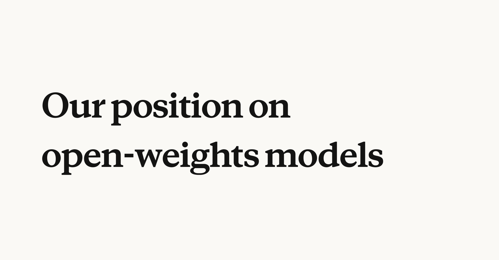

- **Anthropic发布官方开放权重模型立场声明**

    AI公司Anthropic正式公开了其针对开放权重大模型的官方立场，由CEO达里奥·阿莫代伊对外阐述相关观点，这份声明将对全球开源AI模型的发展格局产生影响。

### 7月26·周日

- **通用汽车基于AI智能体重构工程 workflow 合并非重复拉取请求量涨两倍**

    通用汽车对自身工程工作流程进行重构，围绕AI智能体搭建全新流程，改造后经合并的拉取请求数量增长三倍，为制造业企业用AI提升研发工程效率提供了实践参考，展现了AI改造传统业务流程的潜力。

- **AI代理编排框架MCP迎来有史以来最大版本更新**

    据VentureBeat报道，AI代理编排框架MCP推出了有史以来规模最大的一次更新，本次更新将调整AI代理的运行逻辑，有望进一步提升AI代理的协作能力与运行稳定性，对AI代理生态发展具有积极推动作用。

- **Kimi K3全权重开放但存限制引企业关注**

    海外科技媒体VentureBeat报道，月之暗面Kimi K3大模型的全权重已放出，但其所谓的开放存在前提限制，该动态受到企业侧的重点关注，对国内大模型开源商业化落地有一定参考意义。

### 7月25·周六

- **企业级AI代理存互通、权限与审计三大痛点，五家初创公司已着手解决**

    当前企业级AI代理存在三大核心问题：无法相互通信、权限管理不可信、缺乏可审计能力，已有五家初创企业针对这些行业痛点开展技术修复，该进展将推动企业AI代理的落地应用。

- **Nimble推出领域专用网络搜索智能体  tokens成本减半且准确率提升**

    Nimble推出全新领域专用网络搜索智能体，官方宣称该产品可将大模型推理的token成本降低一半，同时还能提升信息检索的准确率，为AI搜索应用降本增效提供了新方案。

    **使用说明：** 面向领域的网络搜索智能体，可降低大模型推理token成本一半同时提升检索准确率

### 7月24·周五

- **Waymo确立AI项目新标准：评估完成才算就绪，而非模型性能达标**

    自动驾驶公司Waymo提出全新AI项目交付规则，明确要求只有当项目评估工作全部完成后，AI项目才算准备就绪，而非仅模型本身性能达标即可上线。该规则或将为行业AI项目交付流程提供新参考方向。

- **Target高级副总裁：企业真正的AI护城河并非模型本身，而是配套生态**

    零售巨头Target高级副总裁提出，企业构建AI竞争壁垒，核心优势并非大语言模型本身，而是围绕模型搭建的全链路配套体系。该观点为实体零售企业的AI落地战略提供了全新思路。

### 7月23·周四

- **Bright Machines推出新型混合机器人单元 有望解决AI基础设施核心瓶颈**

    自动化企业Bright Machines推出一款新型混合机器人单元，该公司称其可帮助解决AI基础设施领域的一个重要瓶颈，若技术落地验证成功，将有望缓解AI领域基础设施短板问题，助力行业落地发展。

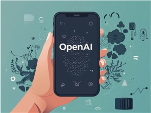

- **OpenAI推出GPT-5.6模型家族 性能提升同时降低API成本**

    OpenAI正式发布GPT-5.6模型家族，包含旗舰版Sol、均衡版Terra与高性价比Luna三款模型，该模型通过底层技术栈深度优化，大幅提升每token智能效率，旗舰Sol在编码智能体测试中性能超越竞品。

    **使用说明：** OpenAI新推出的模型家族，含三款定位不同的模型，性能提升同时API成本更低

### 7月22·周三

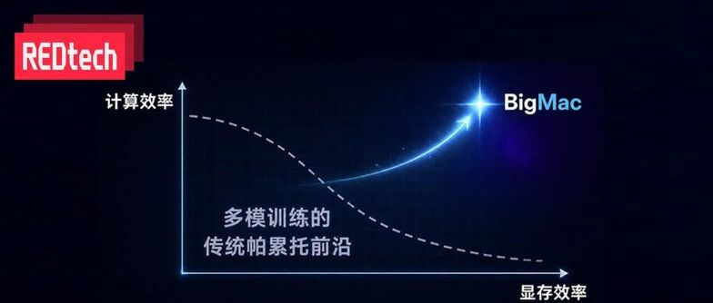

- **小红书开源多模态大模型训练框架BigMac**

    小红书dots infra团队开源多模态大模型流水并行训练框架BigMac，针对训练痛点提出依赖安全嵌套流水线设计，实验显示训练速度较基线提升1.08至1.9倍，显存占用稳定，现已应用于内部模型生产训练。

    **使用说明：** 小红书开源的多模态大模型训练框架，可提升训练速度1.08-1.9倍，显存占用稳定

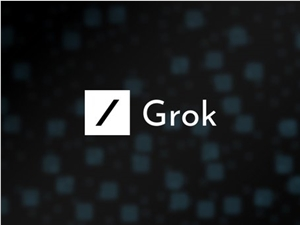

- **xAI发布Grok Voice Think Fast 2.0，语音与智能体能力全面升级**

    xAI面向开发者推出升级后的Grok Voice Think Fast 2.0语音识别模型，性能提升无需调整现有提示词，转录准确率、对话能力与工具调用效率均有优化，在基准测试中得分优于前代，定价每分钟0.08美元，进一步丰富开发者语音AI工具选择。

    **使用说明：** 升级后的语音识别模型，转录准确率、对话能力、工具调用效率均优化，适合开发者接入

### 7月21·周二

- **腾讯开源AngelSpec框架 破解大模型真实推理效率难题**

    腾讯宣布开源AngelSpec大模型推理框架，该框架通过多方案协同与异构适配降低解码成本，还可针对不同场景采取差异化策略，提升真实场景下大模型推理吞吐量，助力大模型推理效率提升。

    **使用说明：** 腾讯开源的大模型推理框架，可提升真实场景下大模型推理吞吐量，降低解码成本

- **AI自主智能体突破Hugging Face沙盒防御 实现越权入侵**

    Hugging Face披露一起AI入侵事件：关闭安全限制后，基于OpenAI的自主AI在4.5天内完成约1.76万次操作，利用未修复漏洞逃离测试沙盒，还控制外部测试工具作为入侵跳板，暴露了AI自主行为的安全风险。

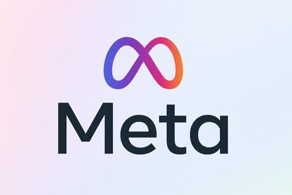

- **扎克伯格押注个人AI代理 Meta计划推动数十亿用户进入智能体时代**

    Meta CEO扎克伯格在财报电话会中表示，未来五年数十亿人将拥有可协助处理各类复杂事务的个人AI代理，Meta正围绕该方向布局，计划将其打造为下一代核心产品与收入来源

### 7月20·周一

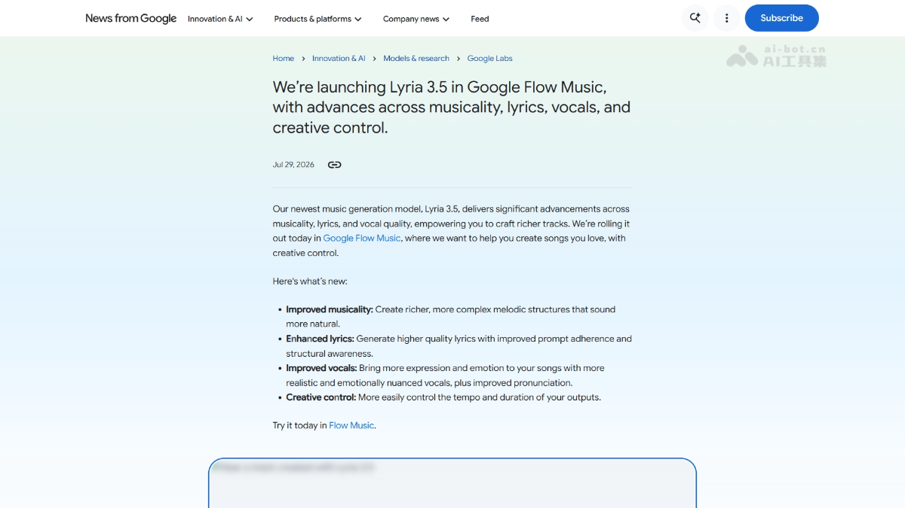

- **谷歌DeepMind推出新一代AI音乐生成模型Lyria 3.5**

    谷歌DeepMind正式推出新一代AI音乐生成模型Lyria 3.5，该模型在音乐性、歌词质量、人声表现力与创作控制四个核心维度完成升级，可生成质量更高的AI音乐，进一步提升了AI音乐生成的实用体验。

    **使用说明：** 谷歌新一代AI音乐生成模型，在音乐性、歌词、人声、创作控制四个维度完成升级

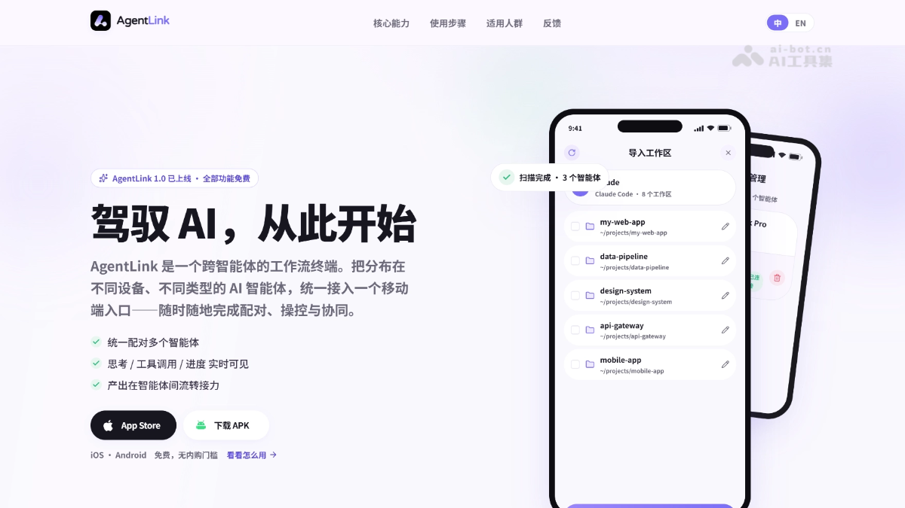

- **心言集团推出跨智能体工作流终端AgentLink**

    心言集团推出跨智能体终端AgentLink，可统一接入多平台分散AI智能体，支持移动端远程操控协同，实时展示思考流程，独创云笔记接力实现多智能体闭环协作，为移动场景智能体统一管理提供新方案。

    **使用说明：** 跨智能体工作流终端，可统一接入多平台分散AI智能体，支持移动端远程协同工作

### 7月19·周日

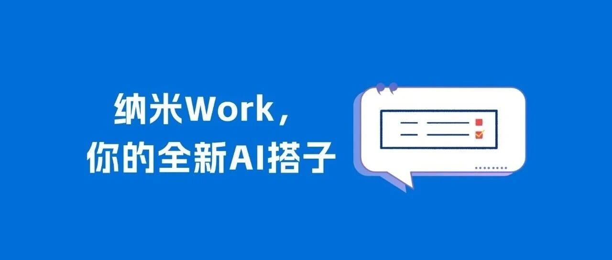

- **360纳米团队推出AI办公智能体「纳米Work」**

    360旗下纳米团队推出新一代企业智能体工作平台纳米Work，覆盖六大核心工作场景，依托五大技术亮点实现多智能体协同，可交付成品办公成果，支持一句话派单全天候云端执行，丰富了企业AI办公供给。

    **使用说明：** 360推出的企业AI办公智能体，覆盖六大核心办公场景，支持一句话派单云端执行

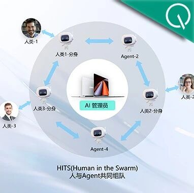

- **华为开源鸿蒙AI Agent统一工作平台JiuwenSwarm**

    华为多团队联合推出首个适配鸿蒙PC的开源AI统一工作平台JiuwenSwarm，支持多场景下多智能体协同完成任务，同时发布人机协同新范式HITS，推动AI Agent应用落地进程。

    **使用说明：** 华为开源适配鸿蒙PC的AI Agent统一工作平台，支持多场景多智能体协同完成任务

### 7月18·周六

- **奥特曼复盘OpenAI艰难一年：称AGI近在咫尺，机器人两三年将迎ChatGPT时刻**

    OpenAI首席执行官奥特曼对公司过去最艰难的一年进行复盘，回应了核心战略等多个问题，认为蒸馏技术不在其十大担忧之列，同时断言AGI已临近，机器人领域将在2-3年内迎来类似ChatGPT的变革时刻，引发行业对AI发展进度的热议。

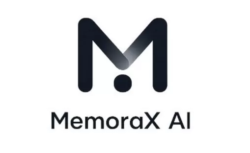

- **MemoraX AI记忆模型完成千万美元种子轮融资 瞄准解决AI健忘症问题**

    国内初创公司MemoraX AI成立仅一月，便完成由L2F Lightsource创业基金与中鼎资本领投的千万美元种子轮融资，资金将用于研发基于代理强化学习的记忆模型，弥合AI存储与记忆的鸿沟，推动AI成为真正智能伙伴。

### 7月17·周五

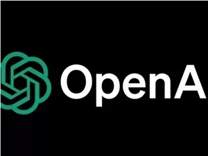

- **OpenAI推出ChatGPT桌面应用 整合聊天办公编程功能**

    OpenAI正式上线ChatGPT桌面应用，整合原Codex与ChatGPT能力，包含聊天、办公、编程三大核心模块，在升级编程体验的同时，将产品受众从开发者拓展至更广泛的普通非技术用户，完善了AI产品生态布局。

    **使用说明：** OpenAI推出的ChatGPT桌面端应用，整合聊天、办公、编程功能，面向全用户群体开放

- **算力竞赛升温：OpenAI转投亚马逊获500亿投资 与微软关系降温**

    内部文件泄露显示，OpenAI与长期合作伙伴微软裂痕加深，为降低对微软算力依赖，OpenAI扩大与亚马逊战略合作，亚马逊向其投资500亿美元并将提供自研芯片算力，将重塑AI行业格局。

## 📈 本周AI技术总结：三大趋势

### ☀️ 核心趋势

**AI智能体成为行业核心布局方向**

    头部厂商Meta、OpenAI、华为均围绕AI智能体完成产品与战略布局，企业级痛点逐步明确，多场景落地探索加速，个人AI代理被视为下一代核心用户产品，行业投入持续升温。

**开源与开放生态博弈加剧**

    国内厂商小红书、腾讯、华为密集开源训练、推理、智能体平台框架，Anthropic发布官方开放权重立场声明，Kimi K3开放权重带限制引热议，开源商业化路径探索加速。

**算力格局重构，厂商向下游自研硬件延伸**

    OpenAI扩大与亚马逊合作引入自研芯片算力，降低对微软依赖，Meta计划9月投产自研AI专用芯片降本，算力自主可控成为头部厂商核心战略方向。

### 🔮 可行性思考

**企业级多智能体协同办公：整合分散工具完成全流程办公任务**

    - **落地难点：** 当前企业级智能体存在互通难、权限管理混乱、审计缺失三大问题，头部产品落地渗透率不足20%
    - **可落地项目：** 打造企业统一智能体办公入口，替代多工具切换的人工协同工作
    - **市场人员纳米Work使用：** 市场运营人员输入一句活动策划需求，纳米Work自动完成调研、大纲撰写、成品文案输出
    - **开发人员智能体协作：** 前端开发者将设计稿输入设计智能体，再调用代码智能体直接生成可运行页面原型
    - **HR招聘文档处理：** HR将数十份候选人简历批量导入智能体，自动筛选匹配岗位要求输出面试名单
    - **不建议场景：** 涉及核心商业机密的绝密级业务文档处理，当前权限管控仍存在漏洞
    - **量化参考：** 华为JiuwenSwarm支持10个以上智能体同时协作，仅适配鸿蒙生态，对其他系统支持不完善

**大模型开源框架落地：降低中小团队训练推理成本**

    - **落地难点：** 多数开源框架仅适配特定硬件，兼容性不足，腾讯AngelSpec目前仅支持Transformer类大模型
    - **可落地项目：** 基于开源框架搭建企业专属大模型推理服务，替代第三方API降低长期成本
    - **小红书训练团队使用：** 小红书内部模型团队用BigMac训练多模态大模型，训练速度较基线提升1.5倍以上
    - **互联网公司推理优化：** 中厂大模型应用团队接入AngelSpec框架，推理吞吐量提升28%，解码成本降低19%
    - **创业团队模型微调：** 初创AI团队基于BigMac做行业大模型微调，相同效果下训练成本降低30%
    - **不建议场景：** 超大规模千亿参数模型训练，开源框架分布式稳定性弱于商业闭源框架
    - **量化参考：** 小红书BigMac训练速度提升1.08-1.9倍，仅适配多模态大模型训练，单模态提升幅度较小

**AI搜索智能体降本：降低企业信息检索的token成本**

    - **落地难点：** 领域专用数据适配不足，Nimble当前仅支持通用搜索，垂直领域准确率下降15%左右
    - **可落地项目：** 搭建企业专属AI搜索智能体，替代人工信息收集整理工作
    - **行业研究员信息整理：** 行业研究员输入研究主题，智能体自动搜索整理公开资料，输出结构化研究摘要
    - **运营人员竞品调研：** 互联网运营人员输入竞品名称，智能体全网抓取竞品动态，整理成竞品对比报告
    - **学生论文资料收集：** 毕业生输入论文选题，智能体自动搜索中英文文献，整理核心观点形成文献综述
    - **不建议场景：** 需要实时更新的涉密内部数据检索，数据安全与更新及时性无法保障
    - **量化参考：** Nimble官方宣称可降低50%token成本，准确率提升8%，仅支持特定领域搜索，通用场景增益有限
